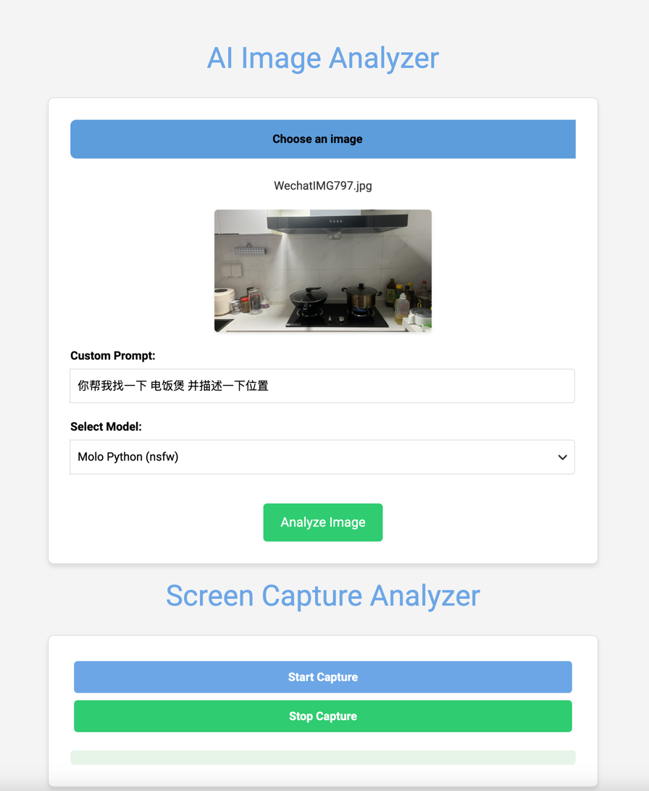
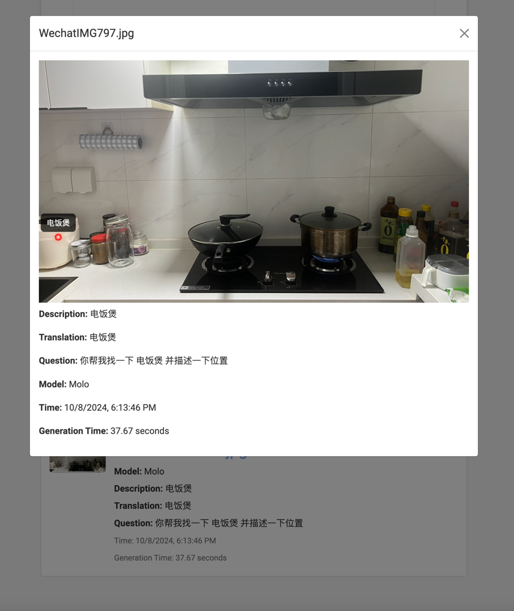

###  Kmars.ai_AI_Image_Analyzer

AI Image Analyzer 

#### Description

This is a simple AI Image Analyzer that uses the `ollama`,`mistral.rs` API or `transformers`  to analyze images. The user can upload an image and the AI will analyze the image and provide a description of the image. The user can also translate the description to a different language.

The original intention of the project is to make a small visual model tool for doing some tests or some simple applications, such as picture description, picture translation, etc.
It may not be perfect but it's a starting point for you to start understanding visual models.

If it is helpful to you, I hope you will not hesitate to give me a star. This will be a recognition of my work. If you have interesting ideas, you can submit them to me on issues.

The current test found that only `Molmo-7B-D-0924` will accurately return coordinate-related information(`<point x="4.5" y="73.0" alt="电饭煲">电饭煲</point>`). Other models seem to be unable to do so. I am trying to let minicpm return spatial information. I believe it will be updated soon.

Since the startup of loading the translation model will be slow, this is normal. Just wait for the web site(`http://127.0.0.1:7777`) to load. Don't worry.

#### model

* allenai/Molmo-7B-D-0924
* Helsinki-NLP/opus-mt-en-zh

#### example (only  `Molmo-7B-D-0924`)

#### Guide

